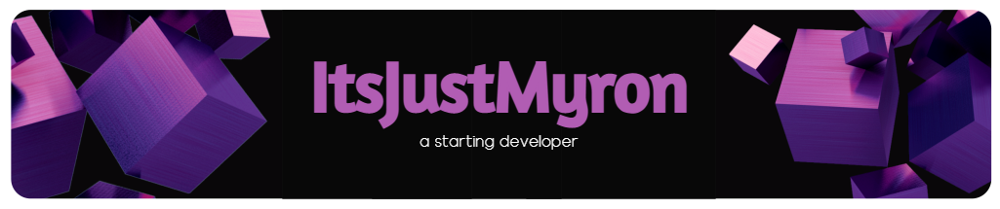

    

    
    &nbsp;
    
    &nbsp;
    

## :bust_in_silhouette: About Me
&nbsp;
Heyo 👋 I'm Myron aka ItsJustMyron, I'm a just starting developer who wants to learn HTML, CSS, PHP, Java and JavaScript, I often play videogames, and like to help people! 😄

## 🔖 My Statistics
&nbsp;

    
    
    
        

    

